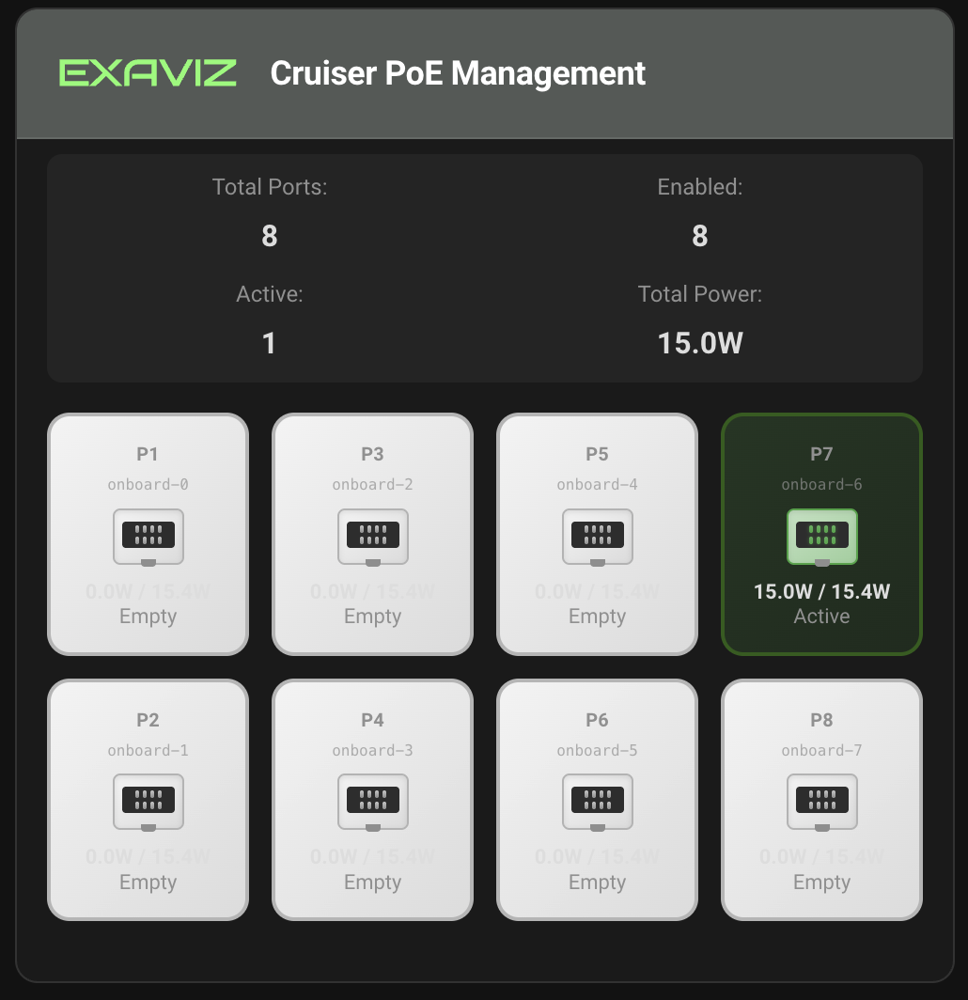
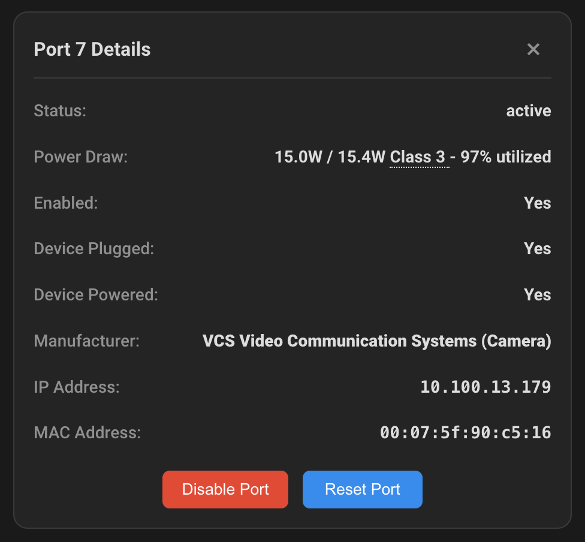

<a href="https://www.exaviz.com">
  
</a>

# Exaviz PoE Plugin for Home Assistant

**Monitor and control Power over Ethernet ports on [Exaviz](https://www.exaviz.com) hardware platforms.**

A zero-configuration Home Assistant custom integration for managing PoE ports on
Exaviz Interceptor and Cruiser carrier boards. Runs directly on the board --
no external servers required.



Click any port tile to see detailed information:



## Features

- **Zero Configuration** -- Automatically detects board type and all PoE systems
- **Real-time Monitoring** -- Port status, power consumption, connected devices
- **PoE Port Control** -- Enable/disable individual PoE ports
- **Device Discovery** -- Identifies connected devices by IP, MAC, and manufacturer
- **Modern Dashboard** -- Lovelace card with dark/light theme support
- **Multi-language** -- 10 languages included (EN, DE, ES, FR, IT, JA, KO, NL, PT-BR, ZH)

## Supported Hardware

| Board | Onboard PoE | Add-on PoE | Max Ports |
|-------|-------------|------------|-----------|
| **Cruiser** (CM5) | 4 or 8 ports @ 1GbE | 1 add-on board (8 ports) | 16 |
| **Interceptor** (CM4/CM5) | None | Up to 2 add-on boards (8 ports each) | 16 |

## Requirements

- Exaviz Cruiser or Interceptor board with PoE support
- Debian-based Linux (Bookworm or Trixie)
- [exaviz-dkms](https://exa-pedia.com/docs/software/apt-repository/) package installed
- Home Assistant 2024.12+ (Docker Container recommended)
- [HACS](https://hacs.xyz/) (Home Assistant Community Store)

## Quick Start

### 1. Install via HACS

1. Open HACS in Home Assistant
2. Click the menu (**...**) then **Custom repositories**
3. Add this repository URL:
   ```
   https://github.com/exavizco/ha-poe-plugin
   ```
4. Set category to **Integration** and click **Add**
5. Search for "**Exaviz**" in HACS and click **Download**
6. Restart Home Assistant

### 2. Add the Integration

1. Go to **Settings > Devices & Services**
2. Click **+ Add Integration**
3. Search for "**Exaviz**"
4. The integration auto-detects your board and PoE systems -- no configuration needed

### 3. Add the Dashboard Card

1. Edit a dashboard and click **+ Add Card**
2. Search for "**Exaviz PoE**"
3. The card will display all detected PoE ports

## Documentation

Full documentation is available at **[exa-pedia.com](https://exa-pedia.com/docs/home-assistant/)**:

- [Installation Guide](https://exa-pedia.com/docs/home-assistant/installation/)
- [Configuration](https://exa-pedia.com/docs/home-assistant/configuration/)
- [Dashboard Setup](https://exa-pedia.com/docs/home-assistant/dashboard/)
- [Troubleshooting](https://exa-pedia.com/docs/home-assistant/troubleshooting/)
- [FAQ](https://exa-pedia.com/docs/home-assistant/faq/)

## Development

### Project Structure

```
custom_components/exaviz/    # Home Assistant integration (Python)
lovelace-cards/              # Frontend Lovelace card (TypeScript)
tests/                       # Test suite
```

### Running Tests

```bash
pip install -e ".[dev]"
pytest tests/ -v
```

### Building Frontend

```bash
cd lovelace-cards
npm ci
npm run build
```

## Links

- **Website:** [www.exaviz.com](https://www.exaviz.com)
- **Documentation:** [www.exa-pedia.com](https://www.exa-pedia.com)
- **Support:** [support@exaviz.com](mailto:support@exaviz.com)

## License

MIT License with Commons Clause -- see [LICENSE](LICENSE) for details.

Copyright (c) 2026 Axzez LLC (aka Exaviz)
